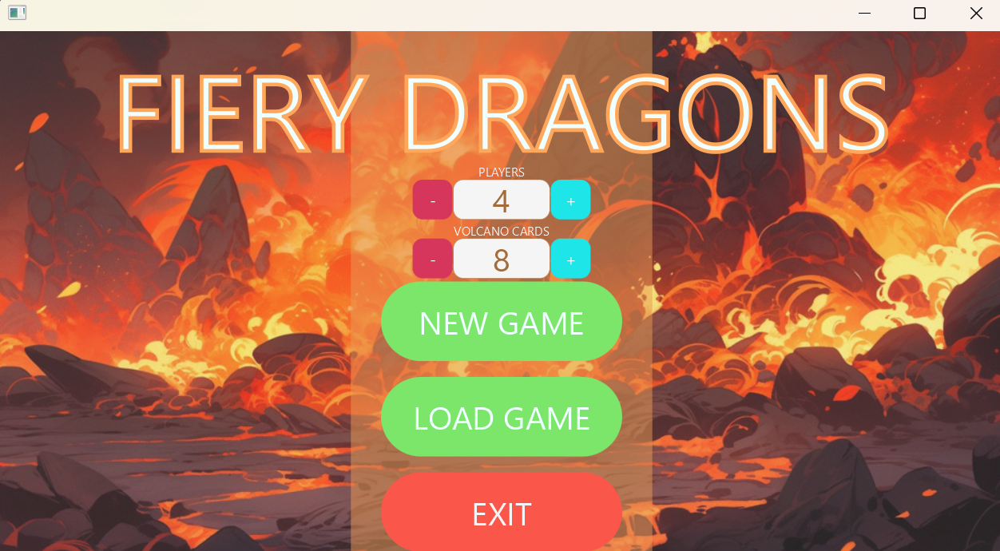
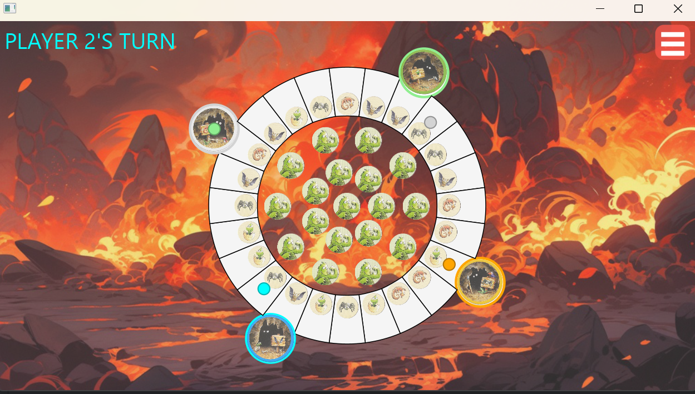

# Fiery dragon Board Game in Java with JavaFx library

Recreate the game [Fiery Dragon](https://boardgamegeek.com/boardgame/23658/fiery-dragons) in Java with the use of design pattern to develop maintanable and scalable source code.





# Usage

### 1. Build the project

Make sure your terminal is in the `Game` directory (the root project folder), then run:

```
./gradlew build # On macOS/Linux
.\gradlew.bat build # On Windows PowerShell or CMD
```

### 2. Run the game

Once the build completes, run the JAR file with:

```
java -jar app\build\libs\app.jar # On Windows
java -jar app/build/libs/app.jar # On macOS/Linux
```
